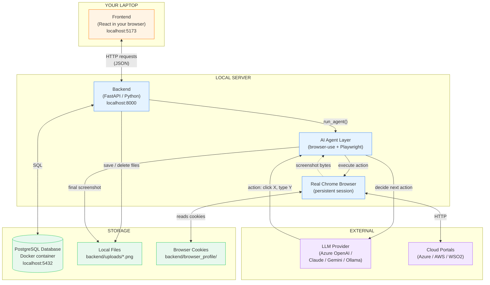
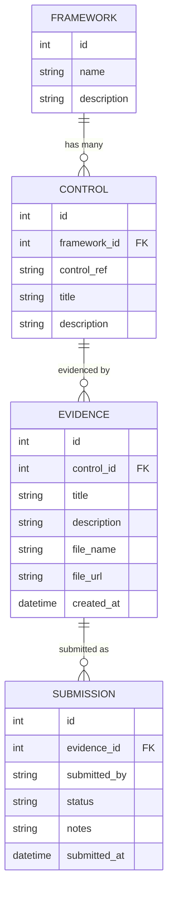
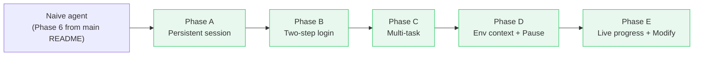

# Project Milestone — Deep Dive

> **Audience:** the author (intern), mentors, SRE reviewers, and anyone joining the project later. Written for a beginner who has never seen the codebase. No syntax, no line-by-line code reading — concepts, components, and *why each piece exists*.

---

## How to read this document

- **Skim first, dive later.** Every section starts with a one-line summary in **bold**.
- **Diagrams come before words.** If a diagram makes sense, the words below it are just commentary.
- **Examples everywhere.** When a concept is abstract, there is a concrete example below it.
- **Cross-links to the code.** When this doc says *"see runner.py"*, click the link — you'll land on the actual file in your editor.

---

## Table of Contents

1. [The 30-Second Pitch](#1-the-30-second-pitch)
2. [The Real-World Problem](#2-the-real-world-problem)
3. [What We Built](#3-what-we-built)
4. [The Big Architecture](#4-the-big-architecture)
5. [Layer 1 — The Frontend (What the User Sees)](#5-layer-1--the-frontend-what-the-user-sees)
6. [Layer 2 — The Backend (The Server Brain)](#6-layer-2--the-backend-the-server-brain)
7. [Layer 3 — The Database](#7-layer-3--the-database)
8. [Layer 4 — The AI Agent (The Magic)](#8-layer-4--the-ai-agent-the-magic)
9. [What is Playwright?](#9-what-is-playwright)
10. [What is browser-use?](#10-what-is-browser-use)
11. [What is an LLM and How Does It Help?](#11-what-is-an-llm-and-how-does-it-help)
12. [Anatomy of an Agent Run (Step by Step)](#12-anatomy-of-an-agent-run-step-by-step)
13. [The Five Evolution Phases (A → E)](#13-the-five-evolution-phases-a--e)
14. [End-to-End Example: "Cloud-Care Across 3 Services"](#14-end-to-end-example-cloud-care-across-3-services)
15. [Security Model — Why It's Safe](#15-security-model--why-its-safe)
16. [How to Demo This (Talking Script)](#16-how-to-demo-this-talking-script)
17. [Glossary](#17-glossary)
18. [What to Read Next](#18-what-to-read-next)

---

## 1. The 30-Second Pitch

> *"WSO2 has to prove to auditors that it follows security rules (SOC2, PCI-DSS, HIPAA). Today, an engineer logs into Azure, takes a screenshot, emails it. We built a portal where an **AI agent driving a real browser** does that automatically — the engineer just types in plain English what they want. The agent navigates, captures, and files the evidence as a database row linked to the right compliance control."*

That's the whole project in one sentence. Everything below explains how.

---

## 2. The Real-World Problem

> **Summary:** Compliance evidence collection at WSO2 is currently manual, repetitive, and error-prone. We want to automate the boring parts without giving an AI access to anyone's password.

### What is "compliance"?

When a company like WSO2 sells software to banks, hospitals, governments — those customers ask: *"Prove that your servers, your processes, your access policies are secure."* This is **compliance**.

The proof is usually a giant PDF / spreadsheet called an **audit report**. Inside it are hundreds of items like:

> *"Control CC6.1 — Logical access to systems is restricted via MFA. **Evidence:** screenshot of Azure AD MFA policy showing MFA is enforced. Captured 2025-10-01 by Jane Engineer."*

That **"screenshot"** part is what we're automating.

### Three frameworks WSO2 cares about

| Framework | What it covers | How many controls |
|---|---|---|
| **SOC2** | General security & operations | 12 controls in our DB |
| **PCI-DSS** | Payment-card data handling | 14 controls |
| **HIPAA** | Health-data privacy | 12 controls |

Each control needs *fresh* evidence every quarter or so. That's **roughly 100+ screenshots per quarter** an engineer has to manually capture.

### Why is this annoying?

- **Repetitive.** Same clicks, same portals, every quarter.
- **Inconsistent.** Different engineers screenshot different things. Auditors complain.
- **No record.** Screenshots end up in random emails / Confluence pages.
- **No deadline tracking.** Easy to miss a control until the auditor calls.

### What we are NOT solving

- Decision-making ("is this control passing?"). Humans still review.
- Login (MFA / SSO). The human still logs in.
- Anything outside web portals (e.g., physical security walkthroughs).

---

## 3. What We Built

> **Summary:** A web app with two complementary tools — a manual upload portal AND an AI agent — both feeding into the same database so all evidence is in one place with a full audit trail.

### The two faces of the app

```
┌──────────────────────────────────────────────────────────────────┐
│  Compliance Evidence Portal                                       │
│                                                                   │
│  ┌──────────────────────────┐  ┌─────────────────────────────┐   │
│  │  Face 1: Manual Upload   │  │  Face 2: AI Agent           │   │
│  │                          │  │                             │   │
│  │  Engineer drags a file   │  │  Engineer types in English  │   │
│  │  picks Framework+Control │  │  picks Framework+Control    │   │
│  │  → Evidence row created  │  │  → Browser opens            │   │
│  │                          │  │  → User logs in (MFA)       │   │
│  │                          │  │  → Agent navigates          │   │
│  │                          │  │  → Screenshot captured      │   │
│  │                          │  │  → Evidence row created     │   │
│  └──────────────────────────┘  └─────────────────────────────┘   │
│                  │                              │                 │
│                  └──────────────┬───────────────┘                 │
│                                 ▼                                 │
│                    Same database, same UI                         │
│                    Same audit trail                               │
└──────────────────────────────────────────────────────────────────┘
```

### The 5 visible pages

| Page | What it does |
|---|---|
| **Dashboard** | Quick stats: total evidence, recent submissions |
| **Evidence** | Browse all stored evidence; filter by framework / source |
| **Submit** | Manual file upload form |
| **History** | Full audit log of every submission ever made |
| **Agent** | Type a prompt → AI captures evidence automatically |

---

## 4. The Big Architecture

> **Summary:** Four big pieces talking to each other over HTTP. Frontend → Backend → Database & Agent. The agent talks to LLMs and Chrome. Everything else is just plumbing.



### Why is it organised this way?

Think of building a house:

| Project layer | House analogy |
|---|---|
| **Frontend** | The decor — what guests see |
| **Backend** | The plumbing & wiring — invisible but everything depends on it |
| **Database** | The basement filing cabinet — long-term storage |
| **AI Agent** | A robot butler living in the house — fetches things you ask for |
| **LLM** | The butler's brain — rented from outside the house |
| **Chrome** | The butler's hands & eyes |

Each layer can be **replaced independently**. Swap React for Vue → backend doesn't care. Swap Postgres for MySQL → frontend doesn't care. Swap Azure OpenAI for Claude → only one file changes.

This separation is called **decoupling** and is the #1 most important idea in modern software.

---

## 5. Layer 1 — The Frontend (What the User Sees)

> **Summary:** Pure presentation. Renders pages, captures clicks, sends HTTP requests to the backend. Has zero business logic. Lives in [frontend/](frontend/).

### What is "frontend" exactly?

When you open `http://localhost:5173` in Firefox, your browser downloads a bunch of JavaScript files. Those files draw the pages, listen for your clicks, and call the backend. **Everything you can see is the frontend.**

Run this experiment: turn off the backend (kill it). Then click around the frontend. The pages still load — they just can't fetch any data. That's because **the frontend lives in your browser, not on the server**.

### The technologies and why we picked each

| Technology | What it does | Why this one |
|---|---|---|
| **React** | UI library — lets us build pages as reusable components | Industry standard. WSO2's other UIs use it too. |
| **TypeScript** | JavaScript + type safety | Catches stupid bugs before they ship. |
| **Vite** | Dev server + builder | Modern, fast, replaces older Webpack. |
| **MUI (Material UI)** | Pre-built buttons, tables, forms | Saves hundreds of hours of CSS. |
| **Oxygen UI** | WSO2's design system on top of MUI | Brand consistency with other WSO2 products. |
| **React Query** | Auto-fetches + caches data from backend | We don't write manual `useEffect` for every API call. |
| **Axios** | HTTP client | Wraps `fetch()` with friendlier API. |
| **React Router** | Switches pages when URL changes | Makes the app feel like a multi-page site, but it's actually one page. |

### The frontend folder tour

```
frontend/
├── index.html                  ← The single HTML file. Everything else is JS injected here.
├── package.json                ← Dependency list (the "shopping list" for npm install)
├── vite.config.ts              ← Tells Vite how to build / serve
│
└── src/
    ├── main.tsx                ← App entry point. Mounts React. Sets up theme + query client.
    ├── App.tsx                 ← Router setup — maps URLs to page components
    ├── index.css               ← Global styles (very minimal)
    │
    ├── api/
    │   └── client.ts           ← THE ONE FILE that knows the backend URL.
    │                              All HTTP calls go through here. Centralized so we can
    │                              change "localhost:8000" → "production.com" in one place.
    │
    ├── components/
    │   └── Navbar.tsx          ← The orange top bar with Dashboard/Evidence/etc links
    │
    └── pages/                  ← One file per visible page
        ├── Dashboard.tsx       ← Stat cards + recent activity
        ├── EvidenceList.tsx    ← Table of all evidence with thumbnails + filters
        ├── SubmitEvidence.tsx  ← Manual upload form
        ├── SubmissionHistory.tsx ← Audit trail table
        └── AgentRunner.tsx     ← The big one — AI agent UI with live timeline
```

### Mental model: the frontend is just three things

1. **Paint** — render visual elements (boxes, tables, text)
2. **Listen** — capture user actions (clicks, typing, dropdowns)
3. **Phone home** — make HTTP calls to the backend via Axios

That's it. No business logic. No "should this evidence be approved?" thinking — that's the backend's job.

### Concrete example: clicking "Run Agent"

1. **Paint:** `AgentRunner.tsx` renders a `<Button>Run Agent</Button>`
2. **Listen:** The button has `onClick={handleRun}` — `handleRun` is a function in the same file
3. **Phone home:** `handleRun` calls `agentApi.startRun({ prompt, control_id, ... })` from `client.ts`, which is just an Axios POST to `http://localhost:8000/api/agent/start-run`

The backend takes over from there.

---

## 6. Layer 2 — The Backend (The Server Brain)

> **Summary:** Owns all the rules. Receives HTTP requests, talks to the database, runs the AI agent, returns JSON. Lives in [backend/](backend/).

### What is "backend" exactly?

A Python program (`uvicorn app.main:app`) listening on `http://localhost:8000`. When the frontend sends a request, the backend:

1. Validates the request (e.g., "is this prompt non-empty?")
2. Looks things up in the database (e.g., "does control_id=12 exist?")
3. Does whatever the request asked for (e.g., "start an agent run")
4. Returns JSON

The backend is the **only thing** that can touch the database or the AI agent. The frontend has to ask permission via HTTP.

### The technologies and why we picked each

| Technology | What it does | Why this one |
|---|---|---|
| **Python 3.11** | Language | Mature ecosystem, browser-use requires it. |
| **FastAPI** | Web framework (async, fast, modern) | Auto-generates API docs at `/docs`. |
| **Pydantic v2** | Data validation | Turns "is this JSON valid?" into a type annotation. |
| **SQLAlchemy 2** | ORM (Object-Relational Mapper) | Talk to the database with Python objects instead of raw SQL. |
| **Alembic** | Database migrations | Version-controls the DB schema (like git for tables). |
| **uvicorn** | ASGI server | The thing that actually listens on port 8000. |

### The backend folder tour

```
backend/
├── requirements.txt             ← Python dependency list
├── alembic.ini                  ← Alembic config
│
├── alembic/                     ← Database migration scripts
│   └── versions/                ← Each file = one schema change in history
│
├── uploads/                     ← Where screenshot PNGs live (gitignored)
├── browser_profile/             ← Where Chrome cookies live (gitignored)
├── .env                         ← Secrets: DB URL, LLM API keys (gitignored!)
│
└── app/
    ├── main.py                  ← FastAPI app object. Sets up CORS, mounts /uploads.
    ├── config.py                ← Reads .env into a Settings object
    ├── database.py              ← Creates SQLAlchemy engine + session factory
    ├── seed.py                  ← One-time script: loads SOC2/PCI-DSS/HIPAA controls
    │
    ├── models/                  ← Database tables expressed as Python classes
    │   ├── framework.py         ← frameworks table
    │   ├── control.py           ← controls table
    │   ├── evidence.py          ← evidence table
    │   └── submission.py        ← submissions table
    │
    ├── schemas/                 ← Pydantic shapes (NOT the DB tables)
    │                              These define request/response JSON.
    │                              Example: AgentRequest has {prompt, control_id, ...}
    │
    ├── api/routes/              ← HTTP endpoints
    │   ├── frameworks.py        ← GET/POST /api/frameworks
    │   ├── controls.py          ← GET/POST /api/controls
    │   ├── evidence.py          ← POST file upload + GET list + DELETE
    │   ├── submissions.py       ← GET audit trail
    │   └── agent.py             ← All the agent endpoints (the big one)
    │
    ├── storage/
    │   └── local_storage.py     ← save_file / delete_file helpers
    │                              (one day we'll swap this for Azure Blob)
    │
    └── agent/
        └── runner.py            ← The agent brain — see Section 8
```

### models vs schemas — the confusion every beginner has

You'll see two folders that look similar: `models/` and `schemas/`. They are **NOT the same thing**.

| Aspect | `models/` (SQLAlchemy) | `schemas/` (Pydantic) |
|---|---|---|
| What it represents | A **database table** | A **JSON shape** for HTTP |
| Fields | Columns (id, title, file_url, ...) | Whatever the API needs (could be a subset) |
| Used for | Reading/writing the database | Validating requests / shaping responses |
| Lives forever | Yes (DB row) | No (transient — only during one HTTP request) |

**Example:** `Evidence` model has 10 columns including `created_at`, `updated_at`, internal IDs. The `EvidenceCreate` schema has only 4 fields: what the user must send to create an evidence row.

### How a request flows through the backend

```
HTTP request comes in
        │
        ▼
[FastAPI receives it at the right route]
        │
        ▼
[Pydantic schema validates the JSON body]
        │
        ▼
[Route handler runs — usually does:]
   1. Look up things in DB (using SQLAlchemy models)
   2. Apply business rules
   3. Maybe write new things to DB
   4. Maybe call the AI agent
        │
        ▼
[Return a Python dict → FastAPI converts to JSON]
        │
        ▼
HTTP response goes back to frontend
```

### Concrete example: POST /api/evidence/

When the user uploads a file:

1. **Frontend** sends a `multipart/form-data` POST with the file + form fields
2. **FastAPI** unpacks the file into a `UploadFile` object and the form into a Pydantic schema
3. **Route handler** in `evidence.py`:
   - Calls `save_file()` from `local_storage.py` → writes the PNG to `backend/uploads/abc123.png`
   - Creates a new `Evidence` SQLAlchemy model → INSERT INTO evidence
   - Creates a new `Submission` SQLAlchemy model → INSERT INTO submissions
   - Commits the transaction
4. **Returns** `{id: 42, file_url: "/uploads/abc123.png", ...}`
5. **Frontend** shows the success message

---

## 7. Layer 3 — The Database

> **Summary:** PostgreSQL inside a Docker container. Four tables in a parent → child chain. Stores metadata about evidence (titles, links, who submitted) — not the actual files.

### Why is the DB in Docker?

Docker is like **a tiny pre-built virtual machine**. Instead of "install Postgres on your laptop manually" (which is annoying), we run `docker compose up -d` and Docker downloads + starts Postgres in 10 seconds. When you're done, `docker compose down` and it's gone.

This is **disposable infrastructure**. Every team member has the exact same database setup with one command.

### The 4 tables and how they connect



### Think of it like a textbook

| DB term | Textbook analogy |
|---|---|
| **Framework** | A whole textbook (e.g., "PCI-DSS Standard 2025") |
| **Control** | One chapter / rule in that textbook (e.g., "Req 8.2 — MFA enforced") |
| **Evidence** | Your homework that proves you read that chapter (the screenshot file) |
| **Submission** | The "turned in on Oct 1 by Jane, currently being graded" sticker on the homework |

### Why do we need both `Evidence` and `Submission`?

It seems redundant — why not just put `submitted_by` directly on `Evidence`?

Because:
- An evidence file can be **submitted multiple times** (e.g., rejected once, fixed, resubmitted)
- We want a full audit trail of every submission event
- The same evidence can have one row in `evidence` and many rows in `submissions` (one per submission attempt)

In our current build we usually create them 1-to-1, but the structure allows growth.

### Cascade delete

When an `Evidence` row is deleted (e.g., by clicking Delete in the UI):

1. All `Submission` rows that reference it are auto-deleted (database cascade)
2. The PNG file on disk is removed (handled by Python code in the delete route)

This keeps the database and the filesystem **in sync**. Never an orphan row, never an orphan file.

### Where the files actually live

**The files are NOT in the database.** They live on disk at `backend/uploads/*.png`. The database only stores the **filename** and a URL like `/uploads/abc123.png`.

Why? Because databases are bad at storing big binary blobs. Storing a 5MB screenshot in a Postgres column would bloat the database and slow every query. Standard practice: **DB stores metadata, filesystem stores blobs.**

When we move to Azure Blob Storage later, only `local_storage.py` changes. The DB stays the same.

---

## 8. Layer 4 — The AI Agent (The Magic)

> **Summary:** The special sauce. An AI brain (LLM) connected to a real Chrome browser via a library called `browser-use`. The brain decides what to click; Chrome actually does it.

### The four ingredients

```
    User prompt (English)
            │
            ▼
   ┌────────────────────┐
   │      Agent         │   ← "browser-use" library
   │  decides actions   │     ties everything together
   └─────────┬──────────┘
             │
        ┌────┴────┬─────────────┬───────────┐
        ▼         ▼             ▼           ▼
   ┌────────┐ ┌────────┐ ┌──────────┐ ┌─────────┐
   │ Brain  │ │ Eyes   │ │  Hands   │ │  Body   │
   │ (LLM)  │ │(vision)│ │(Playwrt) │ │(Chrome) │
   └────────┘ └────────┘ └──────────┘ └─────────┘
```

| Ingredient | What it is | What it does |
|---|---|---|
| **Brain (LLM)** | Azure OpenAI / Claude / Gemini / Ollama | Reads the prompt + page screenshot, decides "click the search box" |
| **Eyes (vision)** | Built into the LLM | The LLM literally sees the page like you do |
| **Hands (Playwright)** | A Python library that controls browsers | Sends the click/type/scroll command to Chrome |
| **Body (Chrome)** | The actual browser window on your screen | Renders pages, sends HTTP, shows the result |

### Why all four?

- **Without the LLM**, the agent would need explicit "click button at coordinate (300, 450)" instructions for every site → impossible to generalize.
- **Without Playwright**, the LLM could think but can't actually click anything → just talk.
- **Without Chrome**, Playwright has nothing to control.
- **Without browser-use**, all three would have to be wired together by hand → weeks of work for every new task.

`browser-use` is the **glue** that makes it all click together.

### Where the agent code lives

The entire agent layer lives in **one file**: [backend/app/agent/runner.py](backend/app/agent/runner.py).

That file is ~250 lines and contains:
- `parse_subtasks()` — turn a numbered prompt into a list of tasks
- `_get_browser()` — make sure Chrome is running with the persistent profile
- `open_browser_at()` — navigate the browser to a URL (no AI involved)
- `_build_llm()` — pick the right LLM provider based on config
- `AGENT_INSTRUCTIONS` — the master prompt that every task is prefixed with
- `run_agent()` — the legacy synchronous run
- `_execute_run()` — the new background coroutine that powers the live UI
- `start_background_run()` — kicks off a run and returns a run_id

We'll dive deeper into each in Section 12.

---

## 9. What is Playwright?

> **Summary:** A library that gives Python code a remote control for real browsers. Think "a robot finger that can click any button on any web page."

### The analogy

Imagine you wanted to write a program that:
1. Opens Chrome
2. Goes to gmail.com
3. Types your email
4. Clicks "Sign in"

Without Playwright, you'd be screwed. Chrome is a separate program; Python can't reach inside it.

**Playwright is the bridge.** It exposes Chrome's internal "remote control protocol" (called the **Chrome DevTools Protocol**, or **CDP**) as Python functions:

```python
await page.goto("https://gmail.com")
await page.fill('input[type="email"]', "me@example.com")
await page.click('button[type="submit"]')
```

Each of those calls is translated under the hood into CDP commands and sent to Chrome.

### Why CDP exists

Chrome already had a remote control system for its own developer tools (the F12 panel). Google opened it up so anyone can use it. Playwright (made by Microsoft) wraps CDP nicely.

This is also why `browser-use` only supports Chromium-based browsers: **Firefox uses a different protocol** (Marionette), so the bridge doesn't fit.

### Headless vs Headed

- **Headed:** Chrome opens with a visible window. You watch it click around.
- **Headless:** Chrome runs invisibly in the background. Faster, used for tests / production.

We use **headed** because the user needs to log in manually (MFA) in the visible window. Once Phase B's manual-login flow runs, the cookies are saved, so future runs *could* be headless — but watching the agent work is also great for demos.

### Persistent profile

By default, every Playwright run starts a **fresh** Chrome with no cookies, no history. That's terrible for compliance work — you'd have to log in every single run.

Playwright supports a `user_data_dir` option pointing to a folder where Chrome saves its profile (cookies, history, saved passwords). We point this at `backend/browser_profile/chrome/`. Result: log in once, stay logged in forever (until cookies expire).

This is the foundation of **Phase A** in our project's evolution.

---

## 10. What is browser-use?

> **Summary:** An open-source Python library that combines an LLM with Playwright. You give it a natural-language task; it figures out the clicks.

### The problem browser-use solves

Without browser-use, building an AI web agent looks like this:

```python
# Pseudocode — what you'd have to write yourself
while not done:
    screenshot = page.screenshot()
    dom_summary = extract_dom_text(page)
    prompt = f"You see this page: {dom_summary}. Task: {task}. What action?"
    response = openai.chat.create(model="gpt-4", messages=[...])
    action = parse_action(response)
    if action.type == "click":
        await page.click(action.selector)
    elif action.type == "type":
        await page.fill(action.selector, action.text)
    # ... 20 more action types
    # ... handle errors, retries, validation
    # ... vision encoding, token management
```

That's **hundreds of lines**, with edge cases everywhere.

**browser-use bundles all of that.** You just write:

```python
agent = Agent(task="go to gmail and screenshot inbox", llm=llm, browser=session)
history = await agent.run(max_steps=15)
```

And it handles the loop, the vision, the parsing, the retries.

### What "agentic" means

You'll hear the word "agentic" everywhere these days. It just means:

> *An LLM in a loop, where each iteration the LLM decides what to do next, until the task is done or we run out of patience.*

In our project:
- **One step** = one LLM call + one browser action (click / type / scroll)
- **A run** = many steps in a loop
- **max_steps** = "give up after this many steps" — our budget

The default we use is 15 (Quick), 25 (Standard), or 40 (Thorough) — user-configurable.

### The "use_vision=True" trick

When `use_vision=True`, browser-use **takes a screenshot before every LLM call** and feeds it to the LLM along with the page's HTML. The LLM literally **sees** the page like you do.

This is what lets the agent handle modern, JS-heavy sites where the HTML alone doesn't reveal the visual state.

Cost trade-off: vision adds ~2,000 tokens per step, which is the bulk of LLM cost.

### Why browser-use is great for compliance

Compliance evidence collection means:
- Navigating to known portals (Azure, AWS, ServiceNow)
- Finding specific resources by name
- Taking screenshots of specific UI states
- Working around region/tenant differences

These are all **language tasks** ("find the Key Vault named X, screenshot the access policies") rather than **scripting tasks**. LLM-driven agents are perfect for this.

---

## 11. What is an LLM and How Does It Help?

> **Summary:** A neural network that takes text in and returns text out. We give it the user's prompt + page screenshot, and it returns an action. That's the entire trick.

### LLM in 3 sentences

A Large Language Model (LLM) is a giant pattern-matcher trained on the internet. You give it text; it produces statistically plausible follow-up text. Examples: GPT-4, Claude, Gemini, Llama, Qwen.

### What LLMs are actually good at (for our case)

| Capability | How we use it |
|---|---|
| **Understand English instructions** | "go to S3, find bucket cloud-care" |
| **See images** (vision-capable models) | Look at a page screenshot, decide what to click |
| **Plan multi-step actions** | Break "screenshot cloud-care" into "click S3 → search → click result → screenshot" |
| **Adapt to unexpected UIs** | If S3 looks different from what it expected, still figure it out |
| **Recover from errors** | If a click misses, try a different approach |

### What LLMs are bad at

- **Counting steps left** — they don't really know how many steps remain in a budget
- **Following long instructions** — too many rules and it forgets some
- **Math / precision** — they're language models, not calculators
- **Knowing things outside their training data** — won't know your internal tools
- **Being deterministic** — same input can give different outputs on different days

We work around these by:
- Setting `max_steps` ourselves (not asking the LLM)
- Keeping `AGENT_INSTRUCTIONS` tight and focused
- Using vision instead of text-only DOM parsing
- Telling the agent explicit context (region, subscription) so it doesn't have to guess

### The four providers we support

| Provider | Where it runs | Cost | Quality | Why use it |
|---|---|---|---|---|
| **Ollama** | Your laptop (local) | $0 | Lowest | Free experiments, no network |
| **Google Gemini** | Cloud | $$ | Good | Cheapest paid option |
| **Anthropic Claude** | Cloud | $$$$ | Excellent | When precision matters |
| **Azure OpenAI** | Cloud (WSO2's Azure tenant) | $$$ | Excellent | WSO2-approved, good price/quality |

The provider is set in `backend/.env` (`AGENT_PROVIDER=azure`). Switching is a one-line change. Code is in [`_build_llm()`](backend/app/agent/runner.py).

### Why cost matters

Each agent step ≈ one LLM call. A 3-task run on Thorough complexity (40 steps × 3 tasks) = up to 120 LLM calls = $0.20-$0.50 depending on model. Multiply by 100 evidence captures per quarter = $20-$50/quarter. Cheap, but worth tracking.

### Tokens — the unit of cost

LLMs charge per **token**, which is roughly **3/4 of a word**. A typical agent step uses:
- Input: ~5,000 tokens (system prompt + page screenshot + history)
- Output: ~200 tokens (the decided action)

Vision-mode screenshots eat the most input tokens — this is why disabling vision saves cost but hurts accuracy.

---

## 12. Anatomy of an Agent Run (Step by Step)

> **Summary:** From "user clicks Run Agent" to "Evidence row appears" — every single thing that happens. Long but exhaustive.

### Setup: assume the user has done Step 1 already

- Browser is open at `console.aws.amazon.com`
- User has logged in (manually, with MFA)
- Cookies are saved in `backend/browser_profile/chrome/`
- User has clicked **I've logged in**

### Step 2: user fills the form

- Picks Framework (e.g., PCI-DSS)
- Picks Control (e.g., Req 8.2 — MFA enforced)
- Picks Task Complexity → **Standard (25 steps)**
- Types the prompt:

  ```
  1. Go to S3, find bucket "cloud-care", screenshot the objects list
  2. Go to EC2, find instance "cloud-care", screenshot details
  3. Go to DynamoDB, find table "cloudcare-tf", screenshot items
  ```
- Sets Environment hint: *"AWS region: Asia Pacific (Mumbai) ap-south-1"*

The **live parsed-task chip** below the textarea shows: *"Detected 3 tasks"*.

### Step 3: user clicks "Run Agent"

The frontend (`AgentRunner.tsx`) calls `agentApi.startRun(...)` with all those fields. This is an Axios POST to `http://localhost:8000/api/agent/start-run`.

### Step 4: backend receives the request

In [routes/agent.py](backend/app/api/routes/agent.py), the `start_run` handler:
1. Validates the prompt isn't empty
2. Looks up the control (control_id=12) in the DB to make sure it exists
3. Defines a `persist_subtask` inner function — this is what writes Evidence + Submission rows after each task completes
4. Calls `start_background_run(...)`

### Step 5: background task starts

`start_background_run()` (in [runner.py](backend/app/agent/runner.py)):
1. Generates a unique run_id (e.g., `"a1b2c3d4e5f6"`)
2. Creates an entry in the `RUNS` dictionary with all the metadata + empty subtasks list
3. Calls `asyncio.create_task(_execute_run(run_id))` — this **doesn't block** the HTTP request

### Step 6: backend returns immediately

The HTTP response is `{"run_id": "a1b2c3d4e5f6", "status": "starting"}`. **Took ~50ms.** The frontend now has a run_id to poll.

### Step 7: frontend starts polling

A `useEffect` hook fires when `runId` changes. It calls `getRun(runId)` every 1.5 seconds and updates the visible timeline.

### Step 8: meanwhile, `_execute_run` is running

```
[_execute_run loop]
   │
   │ 1. Build the LLM client (Azure OpenAI, model=gpt-4.1-mini)
   │ 2. Get the shared browser session (already logged in)
   │ 3. Parse subtasks → 3 tasks
   │ 4. Update RUNS[run_id].subtasks = [task1, task2, task3] (all status="pending")
   │ 5. RUNS[run_id].status = "running"
   │ 6. Build context prefix:
   │       "ENVIRONMENT CONTEXT: AWS region: Mumbai ap-south-1
   │        Before searching, switch to the correct region..."
   │
   │ FOR EACH subtask:
   │    7. If paused, await _pause_event.wait()
   │    8. Update subtasks[i].status = "running"
   │    9. Build full_task = AGENT_INSTRUCTIONS + context + subtask
   │   10. Create new Agent(task=full_task, llm=llm, browser=browser)
   │   11. agent.run(max_steps=25)   ← THE LOOP
   │   12. Get history.final_result() → text
   │   13. Get history.screenshots() → list of base64 PNGs
   │   14. Save the LAST screenshot to backend/uploads/<uuid>.png
   │   15. Call persist_subtask() → INSERT Evidence + Submission to DB
   │   16. Update subtasks[i].status = "completed" + .screenshot + .evidence_id
   │
   │ 17. RUNS[run_id].status = "completed"
   ▼
[end of background task]
```

### Step 9: what happens INSIDE `agent.run()` for ONE task

Take Task 1: *"Go to S3, find bucket 'cloud-care', screenshot the objects list"*.

```
[browser-use agent loop, max_steps=25]

  Step 1:
    [browser-use takes screenshot of current page (AWS console home)]
    [browser-use sends to LLM: "You're at this page (image). Task: ... What action?"]
    [LLM responds: "click the search bar at the top"]
    [browser-use executes: page.click("search input")]

  Step 2:
    [screenshot — search bar is now focused]
    [LLM: "type 's3'"]
    [executes: page.fill(search input, "s3")]

  Step 3:
    [screenshot — dropdown shows S3 result]
    [LLM: "click the S3 result"]
    [executes: page.click("S3 link")]

  Step 4:
    [screenshot — S3 buckets page loaded]
    [LLM: "I see buckets. Need to find 'cloud-care'. Click search bucket input"]
    [executes: page.click("bucket search")]

  Step 5:
    [screenshot — search active]
    [LLM: "type 'cloud-care'"]
    [executes: page.fill("bucket search", "cloud-care")]

  Step 6:
    [screenshot — no exact match. SEARCH STRATEGY says try variations]
    [LLM: "clear and try 'cloudcare'"]
    [executes: clear + fill]

  Step 7:
    [screenshot — sees 'cloudcare-prod-storage' — closest match]
    [LLM: "click 'cloudcare-prod-storage'"]
    [executes: page.click]

  Step 8:
    [screenshot — bucket contents page]
    [LLM: "task says screenshot objects list. The list is here. Take screenshot."]
    [browser-use captures final screenshot]
    [returns history]
```

Task 1 done in 8 steps (well under the 25 budget). Screenshot saved as `uploads/uuid1.png`.

### Step 10: incremental persistence

After Task 1 completes, the runner immediately:

1. Saves the screenshot to disk
2. Calls `persist_subtask()` which opens a fresh DB session and INSERTs:
   - `Evidence(title="AI Agent: ...", description="Go to S3, find bucket...", file_name="uuid1.png", control_id=12)`
   - `Submission(evidence_id=evidence.id, submitted_by="ai-agent", status="pending", notes="...")`
3. Updates `RUNS[run_id].subtasks[0].evidence_id` so the frontend can show it

### Step 11: frontend receives the update

Within 1.5s, the next poll returns:

```json
{
  "status": "running",
  "current_index": 1,
  "subtasks": [
    { "status": "completed", "screenshot": {...}, "evidence_id": 14 },
    { "status": "running" },
    { "status": "pending" }
  ]
}
```

The `RunTimeline` component re-renders: Task 1 card shows green ✓ + the screenshot + "Evidence #14" chip. Task 2 card shows a spinner. Task 3 still says "Waiting...".

### Step 12: repeat for Task 2, Task 3

Same loop. Task 2 (EC2) takes ~10 steps. Task 3 (DynamoDB) takes ~7. Each completes → screenshot saved → Evidence row created → frontend updates.

### Step 13: run completes

`RUNS[run_id].status = "completed"`. Next poll sees this. Frontend stops polling, shows "Run finished — start another?" panel.

### Step 14: optional pause/modify

At any point during steps 9-12 the user could have clicked **Pause**. Effect:
- `POST /api/agent/pause` → `_pause_event.clear()`
- After the *current* task finishes, the loop hits `await _pause_event.wait()` and blocks
- Status flips to "paused" in the polling response
- User intervenes (e.g., switches AWS region manually in the browser)
- User types extra instructions in the yellow textarea → `POST /runs/{id}/modify-next`
- User clicks **Resume** → `POST /api/agent/resume` → `_pause_event.set()` → loop unblocks
- Next task runs with the modification prepended to its prompt

### Step 15: full data trail

After the run, you have:
- 3 PNG files in `backend/uploads/`
- 3 Evidence rows in DB (visible in Evidence page)
- 3 Submission rows in DB (visible in History page)
- All linked to Control #12 (PCI-DSS Req 8.2)
- Audit trail shows: "AI-generated, submitted by ai-agent, pending review, captured 2 minutes ago"

This is **the full life of one prompt**.

---

## 13. The Five Evolution Phases (A → E)

> **Summary:** The agent didn't start with all these features. Each phase fixed a real-world pain point we hit. Knowing the history = understanding the design.



### Phase A — Persistent session

**Problem:** Every agent run launched a brand-new Chrome with no cookies. User had to log in *every single time*. Unusable for daily compliance work.

**Fix:** Two `BrowserProfile` flags:
- `user_data_dir` → save cookies to disk
- `keep_alive=True` → don't kill browser between runs

Plus a global `_shared_browser` singleton so all runs reuse the same browser instance.

**Result:** Log in once, stay logged in until cookies expire (~12-24h).

### Phase B — Two-step login flow

**Problem:** Even with persistent cookies, the *first* run still hits a login page. And the AI agent saw the login page and tried to type credentials — hallucinating fake passwords.

**Fix two parts:**

1. New `open_browser_at(url)` function — drives the browser to the URL using Playwright **without invoking the LLM**. Just `page.goto()`.
2. `AGENT_INSTRUCTIONS` prompt prefix with strict rules: *"You are already logged in. DO NOT type credentials. If you see a login screen, stop and report NOT_LOGGED_IN."*

UI change: Step 1 ("Open Browser & Login") → user logs in manually → clicks "I've logged in" → Step 2 unlocks.

**Result:** User logs in via UI flow, agent never tries to bypass it.

### Phase C — Multi-task prompts

**Problem:** Compliance auditors want chains of screenshots (S3 + EC2 + DynamoDB) tied to the same control. Running the agent 3 times for 3 screenshots was painful and lost context between runs.

**Fix:**
- `parse_subtasks()` reads a numbered/bulleted list out of the prompt
- The agent loop runs each task back-to-back in the same browser
- One Evidence row + one Submission row per task

**Result:** One prompt → multiple screenshots → all evidence in one go.

### Phase D — Environment context + Pause/Resume

**Two problems hit at once:**

1. The agent searched in the wrong AWS region (`us-east-1` default) for resources that lived in `ap-south-1` (Mumbai). Endless "not found" reports.
2. When the agent went off-track, there was no way to stop it without killing the whole run.

**Fixes:**

1. `region_hint` text field — gets injected before every task: *"Before searching, switch to the correct region/subscription..."*. Agent now switches first, searches second.
2. `_pause_event` — an `asyncio.Event` that the loop checks between tasks. Pause endpoint clears it, resume endpoint sets it. Frontend gets pause/resume buttons.

**Result:** Better region awareness + human can intervene without restarting.

### Phase E — Live progress + Modify next task

**Problems:**
- Users clicked Run and stared at a "Agent running..." spinner for 2 minutes with no feedback.
- Refreshing or navigating away wiped UI state — discouraged exploring while waiting.
- Couldn't add "wait, also click X" instructions mid-run.

**Fixes:**

1. **Background runs** — `asyncio.create_task` so the HTTP request returns in 50ms with a `run_id`.
2. **`RUNS` dict** — server-side state machine. Frontend polls `/runs/{id}` every 1.5s for updates.
3. **Live timeline** — each subtask is its own card; status flips pending → running → completed live. Screenshots stream in as captured.
4. **Inline modification** — when paused, a textarea appears. User types extra instructions; backend stores them keyed to the next task; next task's prompt gets the modification prepended.
5. **Incremental DB writes** — Evidence rows appear in the Evidence page **the moment** each task completes, not at the end.
6. **sessionStorage persistence** — login state, run state, prompt, framework selection survive page navigation.
7. **"Start a New Run" button** — clears only run-specific state, keeps login.
8. **Task complexity selector** — Quick/Standard/Thorough maps to max_steps (15/25/40).

**Result:** Modern, responsive UX. Users can navigate freely. Live feedback like watching a video. Can adjust mid-run.

### What we deliberately did NOT do

| Considered | Why we said no |
|---|---|
| WebSockets / SSE for live updates | Polling at 1.5s is plenty for one user. Simpler, more debuggable. |
| Server-side run-state in DB | Restarting the backend cancels in-flight runs anyway. In-memory dict is enough. |
| Cancel mid-step | browser-use doesn't expose mid-step cancellation cleanly. Cancel-between-tasks is good enough. |
| Multiple parallel runs in one browser | The single shared browser session would step on itself. |
| Switching to Firefox | browser-use only supports Chromium-based browsers. Would require rewriting the agent layer. |

Each "no" is a complexity dam we chose not to build. We can break any of them when we have a real need.

---

## 14. End-to-End Example: "Cloud-Care Across 3 Services"

> **Summary:** A realistic full walkthrough an SRE could follow live. Use this as your demo script.

### The scenario

You're an SRE preparing PCI-DSS Q4 evidence for the `cloud-care` workload. You need:
- S3 bucket configuration screenshot
- EC2 instance details screenshot
- DynamoDB table screenshot

All linked to control **PCI-DSS Req 7.1 (Access Restriction)**.

### Step-by-step demo

#### 1. Open the app

```bash
# Three terminals:
docker compose up -d                      # Postgres
cd backend && uvicorn app.main:app        # Backend
cd frontend && npm run dev                # Frontend
```

Open `http://localhost:5173/agent`.

#### 2. Open & login (Step 1 on the page)

- Target Portal: **AWS Console**
- Click **Open Browser & Login**
- Chrome opens at `console.aws.amazon.com`
- Log in with your AWS SSO / IAM credentials + MFA
- Click **I've logged in** in the app

#### 3. Set environment context

- Environment Hint: `"AWS region: Asia Pacific (Mumbai) ap-south-1"`

#### 4. Set up the run (Step 2)

- Framework: **PCI-DSS**
- Control: **Req 7.1 — Access Restriction**
- Title: `"Cloud-care Q4 evidence"`
- Task Complexity: **Standard (25 steps)**
- Prompt:
  ```
  1. Go to S3, find bucket "cloud-care" (or closest match), open it, screenshot the objects list
  2. Go to EC2, find instance "cloud-care" (or closest match), open Instance Details, screenshot the Description tab
  3. Go to DynamoDB, find table "cloudcare-tf" (or closest match), screenshot Items tab
  ```

The live preview shows **"Detected 3 tasks"**.

#### 5. Click Run Agent

Watch the live timeline appear:

- Stats bar: `Running task 1 of 3 · 0 of 3 screenshots captured · 4s elapsed`
- Task 1 card: spinner + "Agent is working on this task..."
- Tasks 2 + 3: "Waiting..."

Meanwhile in the Chrome window, you see the agent searching, clicking, navigating. Don't touch it — just watch.

#### 6. After ~45 seconds, Task 1 completes

- Task 1 card flips to ✓ Completed
- Thumbnail of S3 bucket contents appears
- "Evidence #14" chip appears
- Agent Report panel shows: *"You asked me to screenshot the cloud-care bucket. I found 'cloudcare-prod-storage' (closest match). Opened it and captured the objects list (12 items)."*
- Task 2 card spinner starts

#### 7. Hit Pause (demo the intervention feature)

Click **Pause after current task**. Task 2 finishes naturally (~30s), then the yellow panel appears:

> *"⏸ Paused — you can intervene now. The browser is yours. Switch tabs, change region, scroll, click..."*

#### 8. Type a modification

```
For Task 3, click the "Items" tab specifically (not "Tables overview"),
and make sure to scroll so the timestamps are visible.
```

Click **Save instruction** → chip flips to "Saved ✓".

#### 9. Click Resume Agent

Task 3 starts with your modification prepended. After ~30s, it completes with the *correct* screenshot showing the Items tab with timestamps visible.

#### 10. Final state

- Stats: `All tasks done · 3 of 3 screenshots captured · 1m 47s elapsed · Evidence #14, #15, #16`
- Three thumbnails, three Evidence chips, three Agent Reports
- "Run finished — start another?" panel at the bottom

#### 11. Navigate to Evidence page

Three new rows visible at the top, sorted by date:
- Each shows the thumbnail, the per-task description, the PCI-DSS Req 7.1 chip, "AI Agent" source
- Filter by **PCI-DSS** → only PCI-DSS rows show
- Filter by **AI Agent** → only AI rows show

#### 12. Navigate to History page

Same three submissions with status "Pending". Filter by status → "Pending" → all visible.

#### 13. Total time

**~2 minutes from idea to filed evidence.**

Versus 15-30 minutes manually (open Azure, navigate menus, screenshot, save, email, log it in Confluence, repeat × 3).

---

## 15. Security Model — Why It's Safe

> **Summary:** The agent never sees credentials. MFA stays on your phone. The audit trail records what was captured AND who authenticated.

### Threat model — what we're protecting against

| Threat | Mitigation |
|---|---|
| Agent leaks credentials | Agent has no credential field. `.env` only holds DB URL + LLM API key. |
| Agent goes rogue and deletes things | Agent's prompt explicitly says: "you are read-only — never click Delete, Stop, Terminate buttons." |
| Compromised LLM provider | LLM only sees the page screenshot + task text. No secrets in the prompt. |
| Phished login | User logs in via real browser on their machine. Same security as logging in normally. |
| Stolen browser_profile cookies | File permissions should be `chmod 700`. Cookies expire on backend's host's normal cookie lifecycle. |
| Evidence tampering | DB has `created_at` timestamps. Submissions have `submitted_by`. Cascade rules prevent partial cleanups. |

### What's NOT in the codebase

```bash
# Try this — see for yourself
git grep -i password backend/ frontend/
# Result: only the DATABASE_URL line in .env.example
```

There is **no password handling code anywhere** in this project. We didn't write a "store user password" function because there isn't one to write.

### Identity binding

When the agent captures evidence:
- The `submitted_by` field on the Submission row says `"ai-agent"` (the bot)
- BUT the *cookies the agent used to authenticate* belong to whichever human logged in
- So in practice, the AI's actions are bound to a real WSO2 employee's account
- This shows up in Azure / AWS audit logs as that human's actions

If anyone abuses the system, the audit trail traces back to a real person.

### Why MFA is critical (and why our flow works)

MFA codes go to a phone (Authenticator app, SMS, security key). The agent has no phone, no SMS receiver, no fingerprint. Therefore the agent **cannot complete MFA**. Our two-step flow says: *"You (human) do MFA in the browser. Once you're in, we'll automate the boring parts."*

This is the right model. Production-grade compliance automation tools all work this way.

### What our architecture cannot defend against

Be honest with your mentor:
- **Bad agent prompt** that asks for destructive actions (we have prompt rules but they're not bulletproof — defense in depth would need a separate "allowlist" check)
- **A compromised LLM provider** could in theory exfiltrate the page screenshot. Azure OpenAI on WSO2's tenant is the mitigation.
- **An insider** with access to `backend/browser_profile/` could copy cookies. Filesystem permissions matter.

These are **known limits**, not project flaws. Worth raising in the security review.

---

## 16. How to Demo This (Talking Script)

> **Summary:** A 5-minute live demo script you can deliver to anyone. Use the example from Section 14 as your action.

### The 5-minute story arc

#### Minute 0: The problem

> *"WSO2 has to prove compliance with SOC2, PCI-DSS, HIPAA. Every quarter, engineers manually take ~100 screenshots from Azure, AWS, and other portals and email them to the compliance team. We built a tool that automates that — keeping humans in the loop for security."*

#### Minute 1: The two halves

> *"There are two ways to file evidence in our portal. One: drag and drop a screenshot you took. Two: type in plain English what you want, and an AI agent drives a real browser to capture it."*

Open the Evidence page → show some existing rows.

#### Minute 2: Security first

> *"Before I run the agent — notice how this works. The agent has zero access to my credentials. I log in manually with my MFA. The agent re-uses the session, but never sees the password. Let me show you."*

Go to Agent page → Step 1 → open browser → log in with your actual account.

#### Minute 3: The agent in action

> *"Now let me give it a multi-step task..."*

Type the 3-task prompt from Section 14. Show the live preview ("Detected 3 tasks"). Click Run.

> *"See how the timeline updates live? Each task is running independently. The screenshots stream in as they're captured. The Evidence page is updating in real-time too — I can switch tabs and see Evidence #14 has already appeared."*

#### Minute 4: Human in the loop

> *"If the agent goes off-track — say, wrong region — I can pause it..."*

Click Pause. Show the yellow panel.

> *"I can manually intervene in the browser, AND I can give the next task extra instructions. Then resume. The agent picks up from my new state."*

#### Minute 5: The audit trail

> *"All this evidence is in the database with full audit trail. SOC2 auditors see exactly when each piece was captured, by which method, by which human's session. They click any row and see the actual screenshot."*

Go to History page → show filters → click "Show more" on a notes column.

#### Closing

> *"This took roughly 2 minutes for what would normally be 20+ minutes of manual clicking. And it's repeatable — every quarter we re-run the same prompts with the same controls. The AI handles the boring part; humans review and approve."*

### Phrases to use freely

- *"Human in the loop"* — sounds expert, exactly what we have
- *"Audit trail"* — every compliance person loves hearing this
- *"Defense in depth"* — when explaining security layers
- *"Decoupled architecture"* — when explaining the separation of concerns
- *"Prompt engineering"* — when explaining why the agent behaves well

### Questions you'll be asked (and the answers)

| Q | A |
|---|---|
| "What if the agent makes a wrong screenshot?" | "Humans review every submission before approval — that's why there's a `pending` status. The AI suggests; humans decide." |
| "How do you protect credentials?" | "We don't store them. Users log in via the real browser; the agent re-uses cookies; the agent's prompt explicitly forbids typing credentials." |
| "What if the LLM hallucinates?" | "Our prompt has strict reporting rules — the agent always tells us what it actually found vs what we asked for. If it can't do it, it says so." |
| "Why polling instead of WebSockets?" | "Simpler, no new infrastructure, debuggable with curl. We can upgrade to SSE if we hit scale." |
| "Why Chrome and not Firefox?" | "browser-use only supports Chromium-engine browsers. Firefox would require rewriting the agent layer." |
| "Where do the screenshots live?" | "Local filesystem now (`backend/uploads/`). Azure Blob in a future phase — the storage interface is already abstracted." |
| "How do you handle session expiry?" | "When cookies expire, the next agent run sees a login screen, stops, and reports `NOT_LOGGED_IN`. User re-runs Step 1 to refresh." |
| "Could this be used for non-compliance use cases?" | "Yes — any 'capture web evidence' use case fits. We focused on compliance because of the immediate WSO2 need." |

---

## 17. Glossary

Terms you'll hear in code reviews / SRE meetings. Plain-English definitions.

| Term | Meaning |
|---|---|
| **Agent** | An LLM + tools combo that takes natural-language tasks and executes them autonomously |
| **Agentic loop** | An LLM running in a `while not done:` loop, deciding each step |
| **API** | Application Programming Interface — the contract between two pieces of software |
| **ASGI** | Async Server Gateway Interface — modern Python web protocol (FastAPI uses it) |
| **CDP** | Chrome DevTools Protocol — the language Chrome speaks to remote-control programs |
| **CORS** | Cross-Origin Resource Sharing — browser security rule about which domains can talk to which |
| **Cascade delete** | When you delete a parent row, child rows auto-delete too |
| **CRUD** | Create, Read, Update, Delete — the four basic operations on a resource |
| **Docker** | Containerization tool — lightweight pre-built virtual machines |
| **FastAPI** | Modern Python web framework |
| **FK (Foreign Key)** | A column that references another table's primary key |
| **Headless / Headed** | Whether a browser shows a window (headed) or runs invisibly (headless) |
| **HTTP** | The protocol your browser uses. Request-response. |
| **JSON** | JavaScript Object Notation — the standard data exchange format |
| **LLM** | Large Language Model — GPT-4, Claude, Gemini, etc. |
| **MFA** | Multi-Factor Authentication — password + phone code |
| **Middleware** | Code that runs between request and response (e.g., CORS handler) |
| **MVC** | Model-View-Controller — old architecture pattern. We loosely follow it. |
| **ORM** | Object-Relational Mapper — talk to DB with Python objects |
| **PK (Primary Key)** | A column that uniquely identifies a row (usually `id`) |
| **Pydantic** | Data validation library for Python |
| **Playwright** | Browser automation library |
| **Polling** | Asking "any updates?" repeatedly on a timer |
| **REST** | A common style of API design |
| **SOC2 / PCI-DSS / HIPAA** | Three compliance standards WSO2 cares about |
| **SQLAlchemy** | Python ORM library |
| **SSE** | Server-Sent Events — server pushes updates to client (alternative to polling) |
| **Token (in LLM context)** | ~3/4 of a word; the LLM billing unit |
| **Token (in auth context)** | A string proving who you are (different meaning!) |
| **Tenant** | An isolated customer instance in a cloud product (e.g., "WSO2's Azure tenant") |
| **Vite** | Modern frontend build tool |
| **WebSocket** | Two-way real-time connection (alternative to polling/SSE) |

---

## 18. What to Read Next

In order of importance for a new intern:

1. **Open the actual files referenced in this doc.** Just read the imports and function names. Don't try to understand every line — get a feel for the shape.

2. **[README.md](README.md)** — the technical reference. Use it when you forget an API endpoint or config option.

3. **[backend/app/agent/runner.py](backend/app/agent/runner.py)** — the soul of the project. ~250 lines. Read top to bottom once.

4. **[frontend/src/pages/AgentRunner.tsx](frontend/src/pages/AgentRunner.tsx)** — the most complex frontend file. Shows React state management, polling, timeline rendering, dialogs.

5. **[browser-use docs](https://docs.browser-use.com/)** — official documentation for the library at the heart of our agent.

6. **[Playwright Python docs](https://playwright.dev/python/)** — when you want to understand what Playwright actually does.

7. **[FastAPI tutorial](https://fastapi.tiangolo.com/tutorial/)** — if you've never used FastAPI before. It's excellent.

8. **The WSO2 compliance team's internal docs** — to understand the real-world workflow we're augmenting.

---

## Final note

This project went from "naive agent that opens a browser" to "production-grade human-in-the-loop multi-task compliance pipeline" in five phases. Every phase was driven by a real pain point — not by what was technically impressive.

When you present this to anyone, lead with the **problem**, then the **journey**, then the **tech**. People remember stories, not architectures.

Good luck with the milestone.
